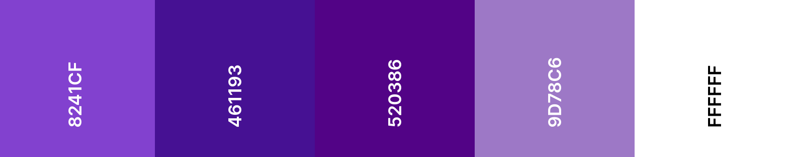

# PRODUCTS - APP
 

<h1 align="center">
   
  <a href="https://products.nipoanz.com/">PRODUCTS APP</a>
</h1> 

Este proyecto consiste en una lista de productos medicos provenientes de [Nutribotics](https://nutrabiotics.info/productos/), en el que se puede ver cada uno de estos, se pueden crear nuevos productos y editarlos, asi mismo se puede realizar una pequeña busqueda de esto para encontrar el producto deseado y poder apreciar su información. Esta app se realiza de acuerdo a los lineamientos dados, asi mismo es diseñada de acuerdo a los colores de la Marca [Nutribotics](https://nutrabiotics.info/) como se puede ver en la siguiente imagen.

Esta app consiste de 5 pantallas que consisten en: 

  - [HomeScreen](https://products.nipoanz.com/)
  - [Productos](https://products.nipoanz.com/products)
  - [Información del Producto](https://products.nipoanz.com/product/1)
  - [404](https://products.nipoanz.com/404)
  - [Editar o Crear Producto](https://products.nipoanz.com/newProduct/new)
 

Las tecnologías utilizadas para esta app son:

   - React
   - React-Router-Dom
   - MongoDB
   - Axios
   - Material-UI